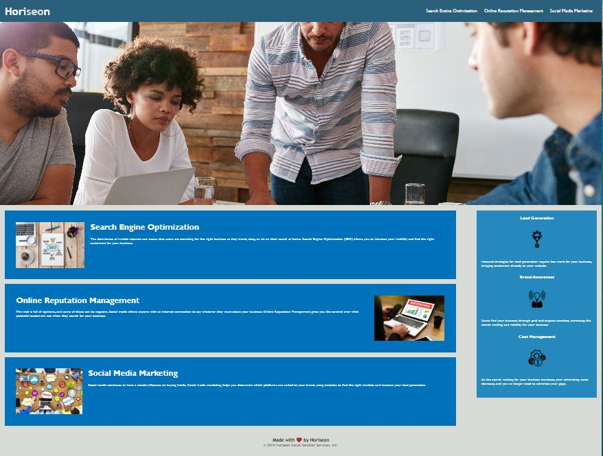

# Horiseon Webpage

## Description

This website has been created to help web administrators to understand
the importance of Search engine optimization, Online reputation, and Social media marketing. Once you know these factors you will
see the great benefits of exploiting them and using them to your advantage.

## Installation

N/A

## Usage

To use this page simply read thru the short explanation of the main topics of Search engine optimization, Online reputation management, and Social media marketing. after reading, ou can do your online reasearch to dig deeper into these topics. Once you know these tolls will be easier to implement and to understand the benefits it will bring to your site like Lead Generation, Brand awareness and Cost management.

The deployment application link is https://gmontano79.github.io/Horiseo/

## Credits

N/A

## License

Please refer to the LICENSE in the repo.
